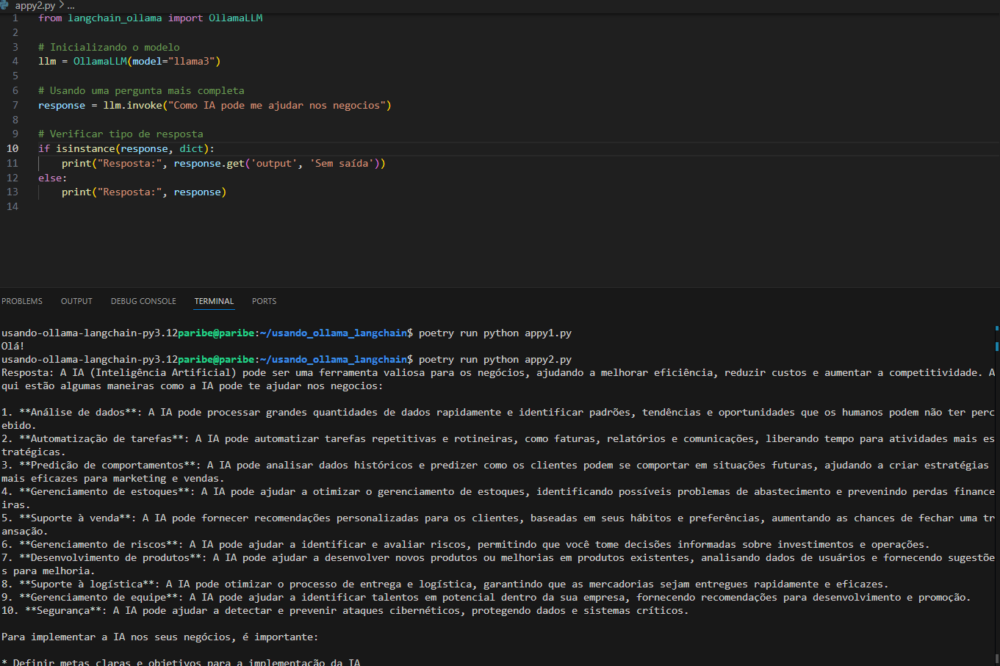

# Usando Ollama com LangChain

Este projeto demonstra como utilizar o modelo Llama 3 através do Ollama em conjunto com a biblioteca LangChain para processamento de linguagem natural.

## Pré-requisitos

- Python 3.12 ou superior
- Poetry (gerenciador de dependências)
- Ollama instalado no sistema

## Instalação do Ollama

1. Instale o Ollama seguindo as instruções do site oficial:
   - Linux/WSL: `curl -fsSL https://ollama.com/install.sh | sh`
   - MacOS: `brew install ollama`
   - Windows: Baixe o instalador em [https://ollama.com/download](https://ollama.com/download)

2. Após a instalação, baixe o modelo Llama 3:
```bash
ollama pull llama3
```

## Configuração do Projeto

1. Clone este repositório:
```bash
git clone [URL_DO_SEU_REPOSITORIO]
cd usando-ollama-langchain
```

2. Instale as dependências usando Poetry:
```bash
poetry install
```

## Estrutura do Projeto

```
usando-ollama-langchain/
├── pyproject.toml
├── README.md
└── src/
    └── main.py
```

## Arquivo pyproject.toml

```toml
[tool.poetry]
name = "usando-ollama-langchain"
version = "0.1.0"
description = ""
authors = ["paribe <paribe@gmail.com>"]
readme = "README.md"

[tool.poetry.dependencies]
python = "^3.12"
langchain = "*"
langchain-community = "^0.3.0"
langchain-ollama = "^0.2.3"

[build-system]
requires = ["poetry-core"]
build-backend = "poetry.core.masonry.api"
```

## Exemplo de Uso

O código abaixo demonstra como utilizar o Ollama com LangChain:

```python
from langchain_ollama import OllamaLLM
import time

try:
    # Inicializa o modelo
    llm = OllamaLLM(model="llama3")
    print("Modelo carregado.")
    
    print("Invocando o modelo...")
    
    # Faz uma pergunta ao modelo
    response = llm.invoke("O que é aprendizado profundo?")
    time.sleep(2)  # Aguarda um tempo para garantir que o modelo teve tempo de responder
    
    # Verifica a resposta
    if response:
        print("Resposta recebida:", response)
    else:
        print("Nenhuma resposta recebida.")
        
except Exception as e:
    print(f"Erro: {e}")
```

## Executando o Projeto

1. Ative o ambiente virtual do Poetry:
```bash
poetry shell
```

2. Execute o script:
```bash
python src/main.py
```

## Solução de Problemas

- Certifique-se de que o Ollama está em execução antes de rodar o script
- Verifique se o modelo llama3 foi baixado corretamente
- Em caso de erros de conexão, verifique se o serviço Ollama está rodando em segundo plano

## Evidências:




